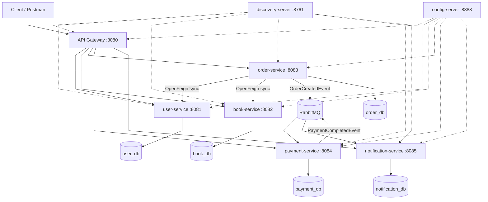

# Online Bookstore Microservices System

A master-level microservices project demonstrating a production-like **Online Bookstore** architecture built with **Spring Boot 3**, **Spring Cloud**, **PostgreSQL**, **RabbitMQ**, and **Docker**.


This system lets customers browse books, place orders, process payments, and receive notifications. External clients interact only with the **API Gateway**. Business capabilities are split across five independent microservices that communicate synchronously (OpenFeign) and asynchronously (RabbitMQ).

## Business Logic

1. **User management**  Register and retrieve bookstore customers.
2. **Book catalog**  Maintain books, pricing, and inventory stock.
3. **Order placement**  When a customer places an order, the order service validates the user and book (sync), calculates total price, persists the order, and publishes an `OrderCreatedEvent` (async).
4. **Payment processing**  The payment service consumes order events, simulates payment (COMPLETED/FAILED), and publishes `PaymentCompletedEvent` on success.
5. **Notifications**  The notification service consumes order and payment events and records user notifications.

## Microservices and Responsibilities

| Service | Port | Responsibility |
|---------|------|----------------|
| discovery-server | 8761 | Eureka service registry |
| config-server | 8888 | Centralized configuration |
| api-gateway | 8080 | Single entry point, routing |
| user-service | 8081 | User CRUD |
| book-service | 8082 | Book catalog and stock |
| order-service | 8083 | Orders, Feign validation, event publishing |
| payment-service | 8084 | Payment simulation, event consumption |
| notification-service | 8085 | User notifications from events |

## Architecture Overview



## Synchronous Communication

- **order-service → user-service**: Validates that the customer exists before creating an order.
- **order-service → book-service**: Validates book existence, reads price, and checks stock.
- Implemented with **OpenFeign** and **Resilience4j** circuit breakers (`feign.circuitbreaker.enabled=true`) with fallback classes.

## Asynchronous Communication

| Event | Publisher | Consumers |
|-------|-----------|-----------|
| `OrderCreatedEvent` | order-service | payment-service, notification-service |
| `PaymentCompletedEvent` | payment-service | notification-service |

Messages are sent through RabbitMQ topic exchange `bookstore.events` with routing keys `order.created` and `payment.completed`.

## Databases

A single PostgreSQL container hosts **five separate databases**:

- `user_db`, `book_db`, `order_db`, `payment_db`, `notification_db`

Each business microservice uses its own database (database-per-service pattern).

## Spring Cloud Components

### Eureka Discovery Server (8761)
Services register on startup. The API Gateway and Feign clients resolve service instances dynamically via `lb://service-name`.

### Config Server (8888)
Centralizes shared and service-specific configuration in the `config-repo/` directory. Services load config via `bootstrap.yml` and can override with environment variables in Docker.

### API Gateway (8080)
Routes external HTTP requests to internal services using Eureka-backed load balancing.

## Docker and Docker Compose

### Prerequisites
- Docker & Docker Compose
- (Optional) Java 21 & Maven 3.9+ for local development

### Start the full stack

```bash
docker compose up --build
```

This starts all infrastructure and microservices. Wait until services are healthy (1–3 minutes on first build).

### Useful URLs

| Component | URL |
|-----------|-----|
| API Gateway | http://localhost:8080 |
| Eureka Dashboard | http://localhost:8761 |
| Config Server | http://localhost:8888 |
| RabbitMQ Management | http://localhost:15672 (guest/guest) |
| PostgreSQL | localhost:5432 (bookstore/bookstore) |

### Stop the stack

```bash
docker compose down
```

Remove volumes: `docker compose down -v`

## Local Development (without Docker)

1. Start PostgreSQL and RabbitMQ locally (or use Docker only for infra):

```bash
docker compose up postgres rabbitmq discovery-server config-server
```

2. Build and run services:

```bash
mvn clean package -DskipTests
java -jar discovery-server/target/discovery-server-1.0.0-SNAPSHOT.jar
java -jar config-server/target/config-server-1.0.0-SNAPSHOT.jar
# Start business services and api-gateway in separate terminals
```

Set environment variables `DB_HOST`, `RABBITMQ_HOST`, `EUREKA_CLIENT_SERVICEURL_DEFAULTZONE`, and `CONFIG_SERVER_URI` as needed.

## Running Tests

```bash
mvn test
```

Tests include:
- **Unit tests** for service-layer logic (Mockito)
- **Integration tests** for user and book REST endpoints (H2)
- **Order service tests** with mocked Feign clients and event publisher
- **Payment/notification tests** for event handling logic

## CI/CD Pipeline

Workflow: `.github/workflows/ci-cd.yml`

| Stage | Trigger | Actions |
|-------|---------|---------|
| **Build** | push, PR | `mvn compile` |
| **Test** | push, PR | `mvn test` |
| **Package** | push, PR | `mvn package`, upload JAR artifacts |
| **Docker Build** | push to main/develop | Build all service images |
| **Deploy (production)** | push to main | Placeholder for registry/K8s deployment |

### Development vs Production

- **Development**: Build + test on every PR; fast feedback loop.
- **Production**: Docker images built on merge to `main`; deploy job uses GitHub `production` environment (configure secrets, registry, and deployment targets in your GitHub repo settings).

## API Endpoint Overview (via Gateway)

Base URL: `http://localhost:8080`

### User Service
| Method | Path | Description |
|--------|------|-------------|
| POST | `/users` | Create user |
| GET | `/users` | List users |
| GET | `/users/{id}` | Get user by ID |

### Book Service
| Method | Path | Description |
|--------|------|-------------|
| POST | `/books` | Create book |
| GET | `/books` | List books |
| GET | `/books/{id}` | Get book by ID |
| PATCH | `/books/{id}/stock` | Update stock |

### Order Service
| Method | Path | Description |
|--------|------|-------------|
| POST | `/orders` | Create order |
| GET | `/orders` | List orders |
| GET | `/orders/{id}` | Get order by ID |

### Payment Service
| Method | Path | Description |
|--------|------|-------------|
| GET | `/payments/{id}` | Get payment by ID |
| GET | `/payments/order/{orderId}` | Get payments by order |

### Notification Service
| Method | Path | Description |
|--------|------|-------------|
| GET | `/notifications/{id}` | Get notification by ID |
| GET | `/notifications/user/{userId}` | Get notifications by user |

## Example Request Bodies

### Create User
```json
POST /users
{
  "firstName": "Alice",
  "lastName": "Johnson",
  "email": "alice@bookstore.com",
  "phoneNumber": "+1234567890"
}
```

### Create Book
```json
POST /books
{
  "title": "Clean Code",
  "author": "Robert C. Martin",
  "isbn": "978-0132350884",
  "price": 39.99,
  "availableQuantity": 50
}
```

### Create Order
```json
POST /orders
{
  "userId": 1,
  "bookId": 1,
  "quantity": 2
}
```

### Update Book Stock
```json
PATCH /books/1/stock
{
  "availableQuantity": 100
}
```

## End-to-End Test Flow (Postman)

1. `GET http://localhost:8080/users` – verify sample users
2. `GET http://localhost:8080/books` – verify sample books
3. `POST http://localhost:8080/orders` with userId=1, bookId=1, quantity=2
4. `GET http://localhost:8080/orders/1` – verify order
5. Wait a few seconds, then `GET http://localhost:8080/payments/order/1`
6. `GET http://localhost:8080/notifications/user/1` – verify notifications

## Production Considerations

- Use managed PostgreSQL and RabbitMQ (AWS RDS, CloudAMQP, etc.)
- Externalize secrets via vault or cloud secret managers
- Enable HTTPS/TLS on the API Gateway
- Configure centralized logging and distributed tracing
- Use container registry and orchestration (Kubernetes)
- Set resource limits and autoscaling policies


## Technology Stack

The project was developed using **Java, Spring Boot, Spring Cloud and IntelliJ IDEA**, with **PostgreSQL** as the database, **RabbitMQ** for asynchronous messaging, and **OpenFeign** for synchronous communication between microservices.

## Project Structure

The project is organized as a multi-module Maven repository. Each microservice is placed in a separate module with its own source code, configuration files, tests, `pom.xml` file and Dockerfile. Infrastructure components such as the API Gateway, Discovery Server and Config Server are separated from business microservices. The `config-repo` directory contains centralized configuration files, while `docker-compose.yml` is used to start the complete system with all services, PostgreSQL and RabbitMQ.


```
online-bookstore-microservices/
├── discovery-server/
├── config-server/
├── api-gateway/
├── user-service/
├── book-service/
├── order-service/
├── payment-service/
├── notification-service/
├── docker/
└── README.md
```


